# 3-Tier Web Application – Manual AWS Deployment

> **Assignment:** Manual Deployment of a 3-Tier Application
> **Platform:** AWS
> **Deployment Type:** Manual
> **Architecture:** Public Frontend + Private Backend + Private Database

---

## 📌 Project Overview

This project demonstrates the manual deployment of a **3-Tier Web Application** on Amazon Web Services (AWS).

The application is divided into three separate layers:

1. **Frontend Layer** – Publicly accessible
2. **Backend / Service Layer** – Private
3. **Database Layer** – Private

The main goal is to ensure that the frontend can be accessed from the public internet while the backend and database remain private and can only be accessed through the required network path.

---

# 🏗️ Architecture

```text
                         Internet
                            |
                            v
                  +-------------------+
                  |  Internet Gateway |
                  +---------+---------+
                            |
                     Public Subnet
                            |
                  +---------v---------+
                  |   Frontend EC2    |
                  |   Public IP       |
                  |   Nginx           |
                  +---------+---------+
                            |
                     Private Network
                            |
                  +---------v---------+
                  |    Backend EC2    |
                  |    Private IP     |
                  |    Node.js        |
                  |    PM2            |
                  +---------+---------+
                            |
                     Private Network
                            |
                  +---------v---------+
                  |   Database EC2    |
                  |    Private IP     |
                  |    MongoDB        |
                  +-------------------+
```

### Architecture Diagram

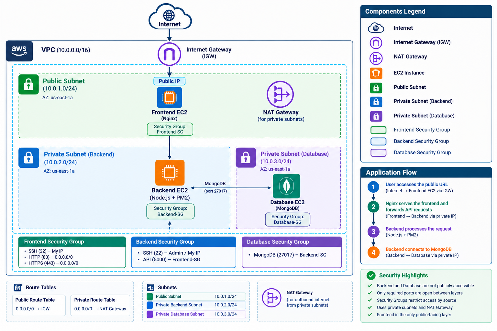

---

# ☁️ AWS Infrastructure

## VPC

The application is deployed inside a dedicated AWS VPC.

```text
VPC CIDR: 10.0.0.0/16
```

### Subnets

| Subnet                  | CIDR          | Type    | Purpose  |
| ----------------------- | ------------- | ------- | -------- |
| Public Subnet           | `10.0.1.0/24` | Public  | Frontend |
| Private Backend Subnet  | `10.0.2.0/24` | Private | Backend  |
| Private Database Subnet | `10.0.3.0/24` | Private | Database |

### VPC Screenshot

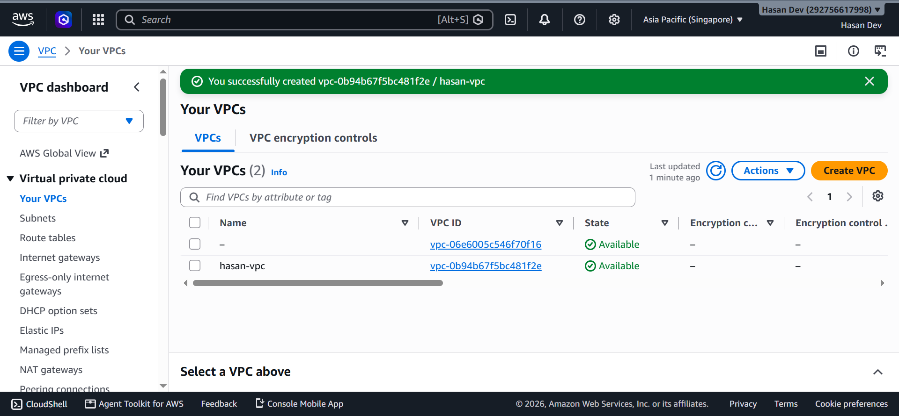

### Subnets Screenshot

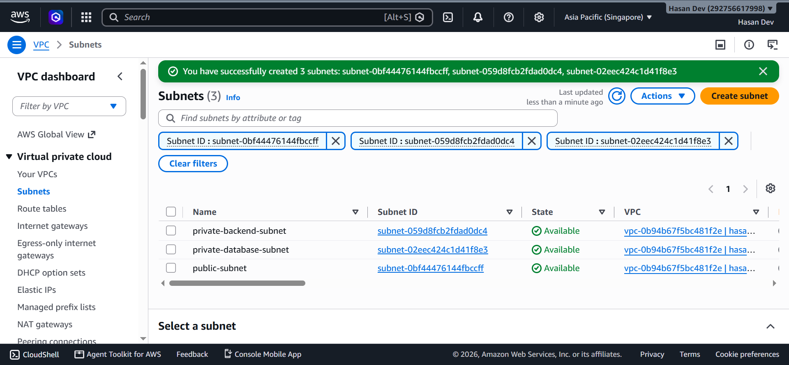

---

# 🌐 Internet Gateway

An Internet Gateway (IGW) is attached to the VPC to provide internet connectivity to the public subnet.

```text
Public Subnet
      |
      v
Internet Gateway
      |
      v
  Internet
```

### Internet Gateway

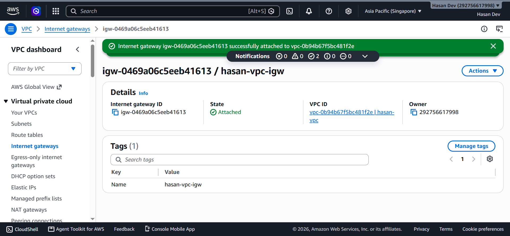

---

# 🔀 Route Tables

## Public Route Table

The public subnet uses the Internet Gateway.

```text
Destination: 0.0.0.0/0
Target: Internet Gateway
```

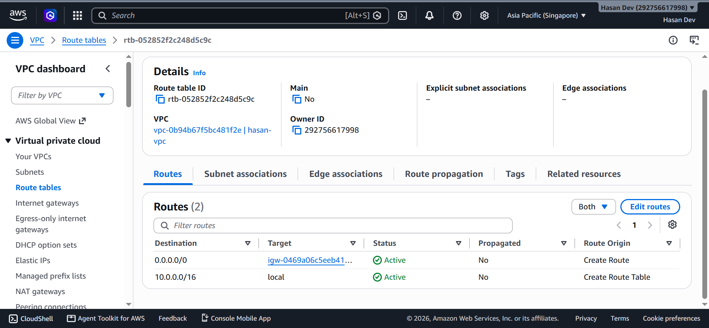

---

## Private Route Table

The private subnets use the NAT Gateway for outbound internet access.

```text
Destination: 0.0.0.0/0
Target: NAT Gateway
```

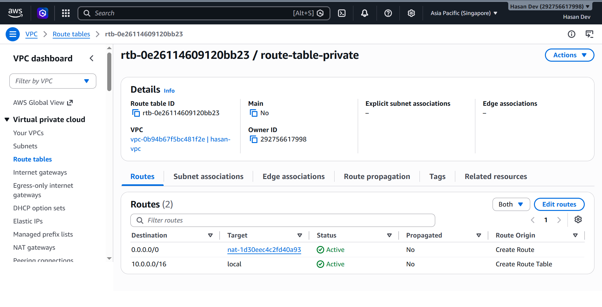

---

# 🔄 NAT Gateway

A NAT Gateway is configured to allow private subnet resources to access the internet for outbound operations such as:

* Package installation
* System updates
* Dependency downloads

The NAT Gateway does **not** provide inbound internet access to the backend or database.

```text
Backend / Database
        |
        v
   NAT Gateway
        |
        v
     Internet
```

### NAT Gateway

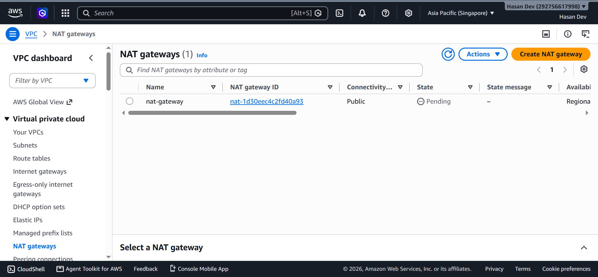

---

# 🖥️ EC2 Instances

Three separate EC2 instances are used for the three application layers.

| Instance     | Subnet  | Public IP | Role             |
| ------------ | ------- | --------- | ---------------- |
| Frontend EC2 | Public  | Yes       | Nginx + Frontend |
| Backend EC2  | Private | No        | Node.js + PM2    |
| Database EC2 | Private | No        | MongoDB          |

### EC2 Instances

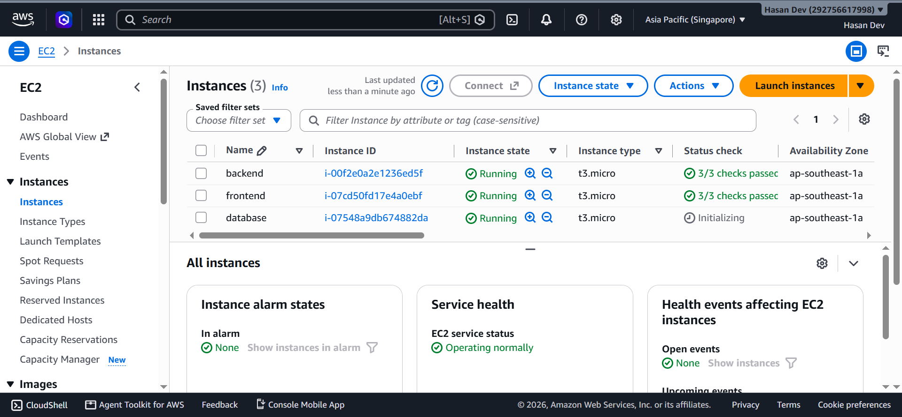

---

# 🎨 1. Frontend Layer

The frontend application is deployed on an EC2 instance inside the public subnet.

Nginx is used to:

* Serve the frontend application
* Handle HTTP requests
* Act as a reverse proxy
* Forward API requests to the private backend

### Request Flow

```text
User Browser
     |
     v
Frontend Public IP
     |
     v
    Nginx
     |
     v
Private Backend
```

The frontend is publicly accessible.

---

## Nginx Configuration

Example configuration:

```nginx
server {
    listen 80;
    server_name _;

    root /home/ubuntu/ostad-assignement4/frontend/dist;
    index index.html;

    location / {
        try_files $uri $uri/ /index.html;
    }

    location /api/ {
        proxy_pass http://10.0.2.188:5000/;

        proxy_http_version 1.1;

        proxy_set_header Host $host;
        proxy_set_header X-Real-IP $remote_addr;
        proxy_set_header X-Forwarded-For $proxy_add_x_forwarded_for;
    }
}
```

> Backend Server Private IP: `10.0.2.188`

### Nginx Configuration Screenshot

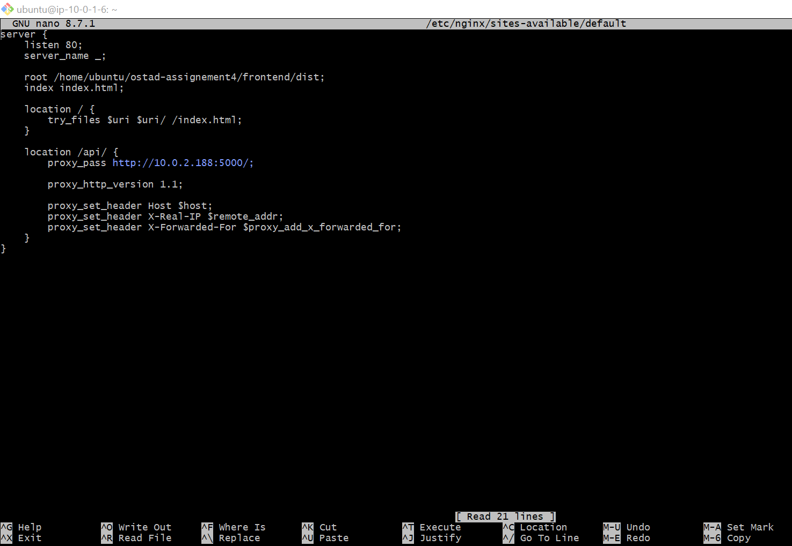

---

# ⚙️ 2. Backend / Service Layer

The backend application is deployed on a separate EC2 instance inside the private subnet.

The backend instance:

* Does not have a public IP
* Runs inside a private subnet
* Runs the Node.js application
* Is managed using PM2
* Accepts API requests only from the frontend layer

### Backend Configuration

```text
Private IP: 10.0.2.188
Application Port: 5000
Process Manager: PM2
```

---

## PM2

PM2 is used to run and manage the Node.js backend application.

### Installation

```bash
npm install
sudo npm install -g pm2
```

### Start Application

```bash
pm2 start server.js --name backend
```

### Save Process

```bash
pm2 save
```

### Enable Startup

```bash
pm2 startup
```

### Check Status

```bash
pm2 status
```

### PM2 Screenshot

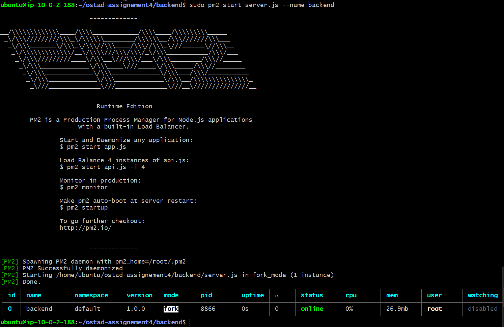

---

# 🗄️ 3. Database Layer

MongoDB is deployed on a separate EC2 instance inside the private database subnet.

The database server:

* Does not have a public IP
* Is located in a private subnet
* Accepts connections only from the backend
* Is not directly accessible from the internet

### Database Configuration

```text
Database: MongoDB
Private IP: 10.0.3.239
Port: 27017
```

---

## MongoDB Configuration

Example:

```yaml
net:
  port: 27017
  bindIp: 10.0.3.239
```

> Database Server Private IP: `10.0.3.239`

### MongoDB Status

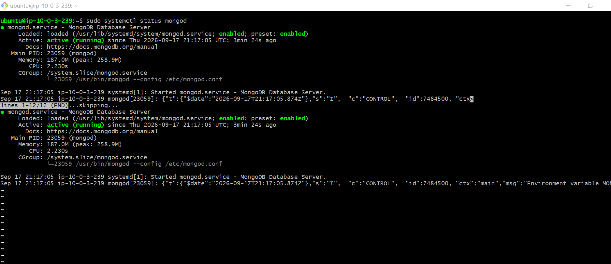

---

# 🔐 Security Group Configuration

Security Groups are used to control communication between the three layers.

---

## Frontend Security Group

| Protocol | Port | Source      | Purpose |
| -------- | ---: | ----------- | ------- |
| TCP      |   22 | My IP       | SSH     |
| TCP      |   80 | `0.0.0.0/0` | HTTP    |
| TCP      |  443 | `0.0.0.0/0` | HTTPS   |

The frontend is the only layer that accepts public HTTP/HTTPS traffic.

---

## Backend Security Group

| Protocol | Port | Source                  | Purpose     |
| -------- | ---: | ----------------------- | ----------- |
| TCP      |   22 | Admin / Required Source | SSH         |
| TCP      | 5000 | Frontend SG             | Backend API |

The backend does **not** allow:

```text
0.0.0.0/0 → TCP 5000
```

Therefore, the backend API is not publicly accessible.

---

## Database Security Group

| Protocol |  Port | Source     | Purpose |
| -------- | ----: | ---------- | ------- |
| TCP      | 27017 | Backend SG | MongoDB |

The database does **not** allow:

```text
0.0.0.0/0 → TCP 27017
```

Only the backend security group can access MongoDB.

---

### Security Group Screenshot

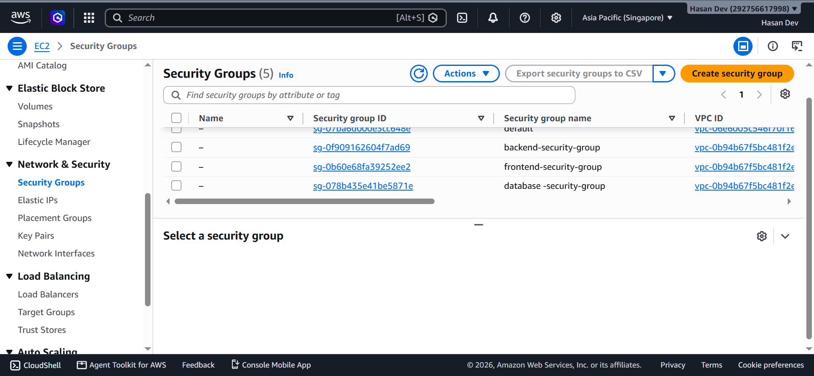

---

# 🔗 Application Communication

The complete application request flow is:

```text
                     Internet
                        |
                        v
               +----------------+
               |    Frontend    |
               |  Public EC2    |
               |     Nginx      |
               +-------+--------+
                       |
                       | HTTP :5000
                       v
               +----------------+
               |    Backend     |
               |  Private EC2   |
               |  Node.js/PM2   |
               +-------+--------+
                       |
                       | MongoDB :27017
                       v
               +----------------+
               |    Database    |
               |  Private EC2   |
               |    MongoDB     |
               +----------------+
```

---

# 🛡️ Network Security

The architecture follows the principle of restricting access between application layers.

### Public Access

```text
Internet
    |
    v
Frontend
    |
    v
Allowed
```

### Backend Direct Access

```text
Internet
    |
    X
Backend
```

### Database Direct Access

```text
Internet
    |
    X
Database
```

### Backend → Database

```text
Backend
    |
    v
Database
    |
    v
Allowed
```

---

# 🧪 Connectivity Verification

The following tests are performed to verify the architecture.

## Test 1 – Frontend Public Access

```text
http://<FRONTEND_PUBLIC_IP>
```

Expected result:

```text
Frontend → Accessible
```

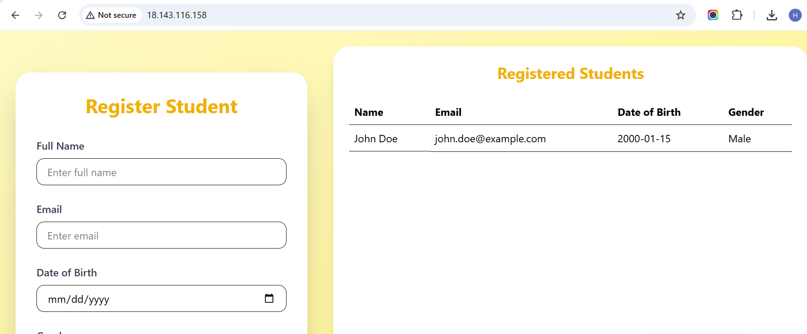

---

## Test 2 – Backend Direct Public Access

The backend does not have a public IP.

Expected result:

```text
Internet → Backend
        ❌ Not Accessible
```

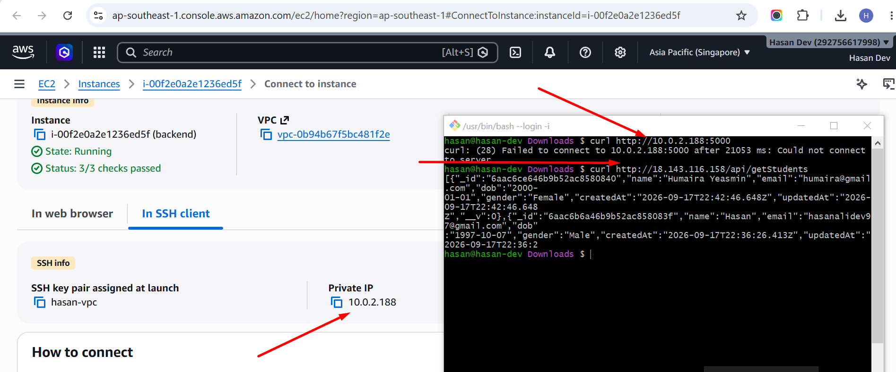

---

## Test 3 – Database Direct Public Access

The database does not have a public IP.

Expected result:

```text
Internet → MongoDB
        ❌ Not Accessible
```

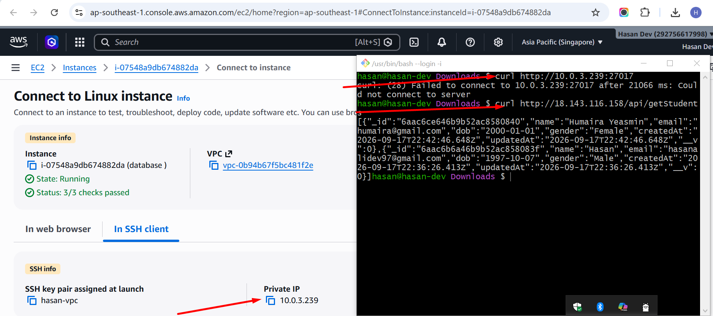

---

## Test 4 – Frontend → Backend

Nginx forwards API requests from the frontend server to the backend's private IP.

```text
Frontend
   |
   v
Nginx
   |
   v
Backend Private IP:5000
```

Expected result:

```text
Frontend → Backend
          ✅ Allowed
```

---

## Test 5 – Backend → Database

The backend connects to MongoDB through the private network.

```text
Backend Private IP
        |
        v
Database Private IP:27017
```

Expected result:

```text
Backend → Database
          ✅ Allowed
```

---

# 📸 Deployment Screenshots

## AWS VPC


## Subnets


## Route Tables

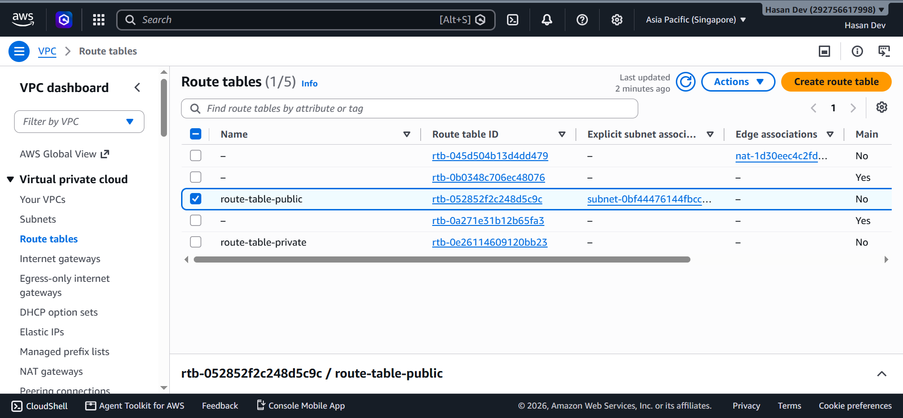

## Internet Gateway


## NAT Gateway


## EC2 Instances


## Security Groups


## Nginx Configuration


## PM2 Status


## MongoDB


## Public Application


---

# 🌍 Public Application

The deployed frontend application is available at:

**Public URL:**

```text
http://18.143.116.158
```

---

# 📊 Server & IP Configuration

| Layer    | Server | Private IP              | Public IP              | Port  |
| -------- | ------ | ----------------------- | ---------------------- | ----- |
| Frontend | EC2    | `TBD`                   | `18.143.116.158`       | 80    |
| Backend  | EC2    | `10.0.2.188`            | None                   | 5000  |
| Database | EC2    | `10.0.3.239`            | None                   | 27017 |

---

# 📁 Project Structure

```text
ostad-assignement4/
│
├── README.md
│
├── frontend/
│   └── ...
│
├── backend/
│   └── ...
│
├── nginx/
│   └── default.conf
│
└── screenshots/
    ├── architecture-diagram.png
    ├── vpc.png
    ├── subnets.png
    ├── route-tables.png
    ├── public-route-table.png
    ├── private-route-table.png
    ├── internet-gateway.png
    ├── nat-gateway.png
    ├── ec2-instances.png
    ├── security-groups.png
    ├── nginx-config.png
    ├── pm2-status.png
    ├── mongodb-status.png
    ├── backend-private.png
    ├── database-private.png
    └── public-application.png
```

---

# 🎯 Assignment Requirements

| Requirement            | Status       |
| ---------------------- | ------------ |
| Public Frontend        | ✅ Completed  |
| Nginx                  | ✅ Configured |
| Private Backend        | ✅ Completed  |
| PM2                    | ✅ Configured |
| Private Database       | ✅ Completed  |
| AWS VPC                | ✅ Configured |
| Public Subnet          | ✅ Configured |
| Private Subnets        | ✅ Configured |
| Internet Gateway       | ✅ Configured |
| NAT Gateway            | ✅ Configured |
| Route Tables           | ✅ Configured |
| Security Groups        | ✅ Configured |
| Frontend → Backend     | ✅ Working    |
| Backend → Database     | ✅ Working    |
| Public Application URL | ✅ Available  |

---

# 📝 How the 3-Tier Architecture Works

The application is separated into three layers to improve security, maintainability, and network isolation.

### Frontend Layer

The frontend is located in the public subnet and can be accessed by users from the internet. Nginx serves the frontend and forwards API requests to the backend using the backend's private IP address.

### Backend Layer

The backend is located in a private subnet and does not have a public IP. It can receive requests from the frontend layer through the private network.

### Database Layer

MongoDB is located in a separate private subnet and does not have a public IP. Database access is restricted to the backend security group.

Therefore, the final communication path is:

```text
User
 ↓
Internet
 ↓
Frontend + Nginx
 ↓
Private Backend
 ↓
Private MongoDB
```

This ensures that the backend and database are not directly exposed to the public internet.

---

# ✅ Final Result

The 3-Tier application has been manually deployed on AWS with the following architecture:

```text
                    INTERNET
                       |
                       v
                PUBLIC SUBNET
                       |
               FRONTEND + NGINX
                       |
                       v
               PRIVATE SUBNET
                       |
                BACKEND + PM2
                       |
                       v
               PRIVATE SUBNET
                       |
                    MONGODB
```

The frontend is publicly accessible, while the backend and database remain private and can only be accessed through the required network path.

---

## 👨‍💻 Author

**Name:** `Md Hasan Ali`
**Role:** Software Engineer
**Project:** 3-Tier Application – Manual AWS Deployment
**Platform:** AWS
